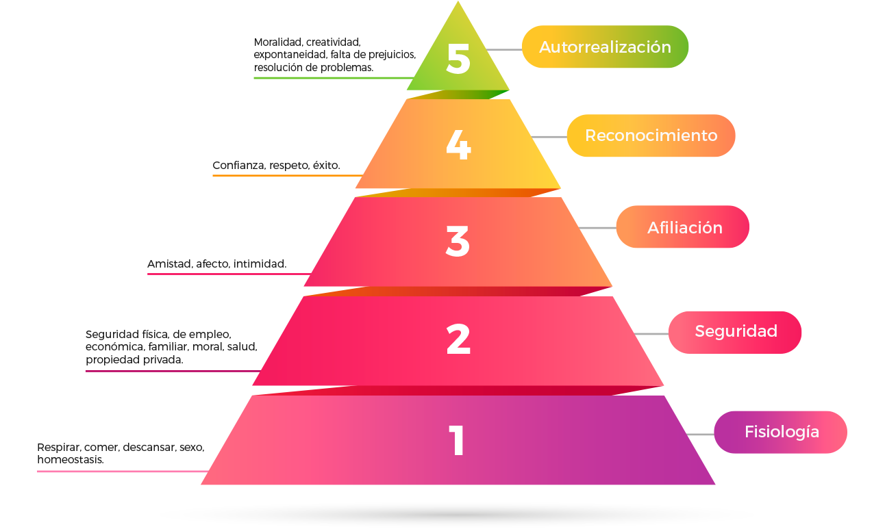

# Pirámide de Maslow

## Equipo de desarrollo

- Jeremias Salomon
- Juan Ignacio Borda
- Ignacio Crusoe
- Facundo Malnero

## Capturas

 

## Reglas de Juego / Instrucciones

Hay 2 personajes:
- Personaje Inteligente
 
- Personaje Fuerte
 
La idea del juego es que los personajes satisfagan las necesidades de cada escalón de la Pirámide de Maslow

Deben trabajar en equipo para lograr abrir la puerta que los llevará al objetivo de cada nivel.
Para ello deben:
- Desbloquear todos los códigos
- Presionar todas las placas

Ambos personajes pueden presionar placas
El Personaje Inteligente puede desbloquear códigos durante 5 segundos
El Personaje Fuerte puede empujar cajas, que a su vez estas pueden presionar placas y atravesar pinches

Por nivel hay 3 vidas que son compartidas por ambos jugadores, si uno se pincha ambos pierden una vida
Lograrás alcanzar la autorrealización?

Si te trabaste en algún nivel y no lo podés sacar acá hay un video de cómo pasar el juego :)
https://www.youtube.com/watch?v=XfbaUXJPDMk

## Otros

- UTN FRBA K2004/K2104
- Versión de Wollok 3.0.0
- Una vez terminado, no tenemos problemas en que el repositorio sea público
