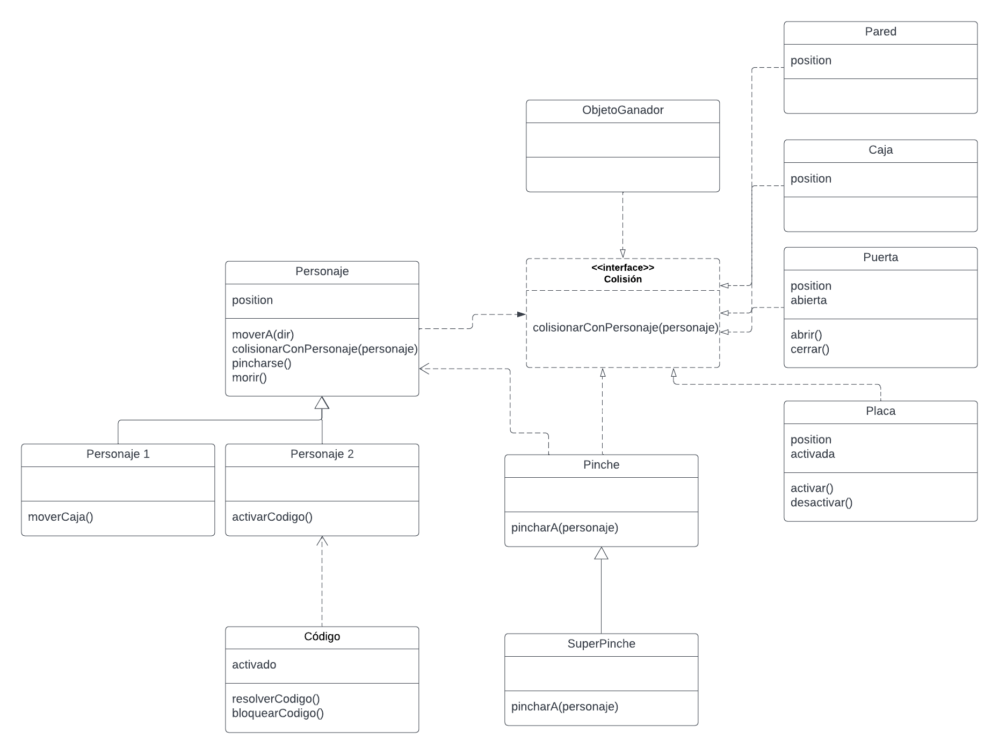

# Pirámide de Maslow

## Equipo de desarrollo

- Jeremias Salomon
- Juan Ignacio Borda
- Ignacio Crusoe
- Facundo Malnero

## Capturas

## Reglas de Juego / Instrucciones

El juego consiste en hacer llegar a dos personajes, uno fuerte y otro inteligente, a uno de los objetos que les permitirá satisfacer las distintas necesidades de la pirámide de Maslow. Para ello deben trabajar en conjunto y lograr abrir la puerta que los dirige hacia el objetivo, debiendo pasar por diversos obstáculos. Al perder las 3 vidas que tienen, termina el juego. 
- Las *paredes* no pueden ser atravesadas por ningún personaje.
- Los *pinches* le quitan una vida a cualquiera que pise sobre ellos. También hay *super pinches* que quitan dos vidas.

El *personaje inteligente* puede activar *códigos*, los cuales se activan únicamente por 4 segundos. Su movimiento se ve determinado por las flechas del tecado (←↑→↓).
El *personaje fuerte* puede mover *cajas*, las cuales pueden posicionarse sobre placas y ser utilizadas para permitirle al personaje inteligente pasar por pinches. Para moverse, este utiliza las teclas WASD.

Para poder abrir la puerta:
- Deben estar todos los códigos activados.
- Deben estar todas las placas presionadas.

## Conceptos Teóricos

**Polimorfismo: ¿Cuáles son los mensajes polimórficos? ¿Qué objetos lo implementan? ¿Qué objeto se aprovecha de ello?**

| Mensaje polimorórfico | Objetos que lo implementan | Objeto que se aprovecha |
| --- | ----------- | --- |
| siguientePosicion(pos) | izquierda - derecha - abajo - arriba | clase ObjetoMovible |
| crear() | clase Objeto - bordes | clase Nivel |
| configuracionInicial() | clase Placa - clase Código| clase Nivel |
| moverA(dir) | clase Objeto | clase PersonajeFuerte |
| esCaja() | clase Objeto | clase PersonajeInteligente|
| activado() | clase Placa - clase Codigo | clase Nivel|
| danio() | clase Pinche (y SuperPinche)| clase Personaje |

**Colecciones: ¿Qué operaciones de colecciones se utilizan? ¿Usaron mensajes con y sin efecto? ¿Para qué?**

Se utilizan colecciones para establecer el comportamiento de las placas. Al requerir que todas las placas deben estar presionadas para abrir la puerta, fue necesario utilizar la función “all()”.Este mensaje no tiene efecto ya que se utiliza para validar que todas las placas estén presionadas, sin provocar ningún efecto en ellas como cerrarlas o abrirlas.
También se utiliza el mensaje “forEach()” en las colecciones de paredes y de placas para ejecutar el método “addVisual()”. Este mensaje sí tiene efecto colateral.

**Clases: ¿Usan clases? ¿Por qué? ¿Dónde o cuándo se instancian los objetos?**

Se utiliza la clase “personaje” para modelar a los personajes con sus métodos necesarios como “moverA()” y “colisionarConPersonaje()”. A partir de esta clase se crearon las subclases “personaje1” y “personaje2” para establecer el comportamiento individual de cada uno de los dos personajes y no repetir lógica al establecer los métodos “moverA()” y “colisionarConPersonaje()” previamente establecidos en la clase “personaje”. Estas dos clases son instanciadas en el archivo “main.wlk” como constantes al ejecutar el programa, en donde se crean los objetos “personajeFuerte” y “personajeDebil”.

**Herencia: ¿Entre quiénes y por qué? ¿Por qué no? ¿Qué comportamiento es común y cuál distinto?**

Hay relaciones de herencia entre las clases “personaje1” y “personaje2” con la superclase “personaje”. Esto se debe a que ambas clases, “personaje1” y “personaje2”, deben heredar los métodos “moverA()” y “colisionarConPersonaje()”. El método “moverA()” es común a todas las subclases de “personaje”, mientras que “colisionarConPersonaje()”se sobrescribe en cada una de las subclases.
También hay herencia entre los pinches y los superPinches, que modifican el comportamiento del método pincharA(personaje).

**Delegación de responsabilidades: ¿Qué objetos interactúan? ¿Dónde se delega? ¿Qué tan fácil sería de modificar o extender?**

El método “colisionarConPersonaje()” se delega a las clases “placa”, “puerta”, “caja” y “pared”, los cuales requieren que se les pase por parámetro al objeto (personaje) con el que colisionan. Podrían crearse fácilmente nuevos objetos que puedan colisionar con personajes, siempre que estos entiendan el mensaje “colisionarConPersonaje()”.

Otro caso de delegación de responsabilidades es en el gestor de niveles, quien le delega la responsabilidad al nivel actual de configurarse a sí mismo. El gestor de niveles tampoco se encarga de reiniciar el nivel actual, sino que lo hacen los niveles. El gestor de niveles les envía el mensaje "reiniciarse()". Estos niveles a su vez le delegan a cada objeto que tienen la responsabilidad de crearse mediante el método "crear()". 

## Diagrama

## Otros

- UTN FRBA
- Versión de wollok
- Una vez terminado, no tenemos problemas en que el repositorio sea público / queremos manternerlo privado
